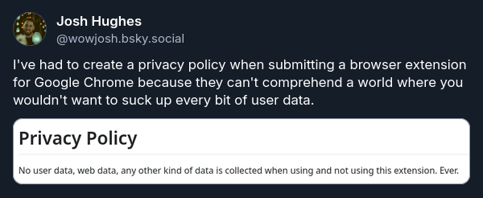

"The coding is the easy part!" has been the cry of developers since the dawn of agentic coding, and when it comes to developing browser extensions it's definitely the case.

Last year I discovered the focused reading feature on the Kindle app and thought it was a great idea. I'd not discovered it sooner because I do mainly read either physical books or on my Kindle device itself which doesn't support it since e-ink displays don't refresh fast enough. Since I read a lot of articles on the web I thought "I wonder if I can get a browser extension for this?" Lo and behold, you can! There's a few, but they all require a permission to "read the page contents" which, to me, is a bit unsettling because if the developer were being malicious, they could potentially harvest my personal information. Instead I chose to start my journey into developing with AI by creating my own version where I know it's not doing anything malicious under the hood.

I called it Speedr, a portmanteau of speed reader. My creativity is unbounded.

Everything was smooth sailing. I got it working locally, even on Zen, my browser of choice which is a Firefox fork. Since I use Zen on multiple devices I thought it would be nice to add it to the Mozilla extensions marketplace so I can easily install it instead of moving the code around everywhere and manually adding it via the developer tools. This part was easy. Mozilla seem very lax when it comes to adding an extension to their marketplace. Just a couple of questions about the app, upload a zip with the `manifest.json` and the files for a security check and you're pretty much online with a warning that the code may be reviewed in the future.

All is good, I've got my extension everywhere I want it.

Unfortunately for me some companies don't like their employees venturing outside of the standard issue Chrome/Edge browsers so I thought it'd be nice to make Speedr available on the Google extension marketplace. Should be easy right? It was pretty straightforward to get it on Firefox.

Well, for those who have been involved in mobile app development, you'll be used to the wacky and wild requirements you need to hit in order to appease Apple and Google, but for browser extensions, it seems Google has cranked that up to 11.

To start with, Chrome browsers now require manifest v3 of the `manifest.json` file whilst Firefox allows both v2 and v3. So whilst I could just change the `manfiest.json` to be v3. Since I've got it working with Firefox on v2, I decided don't fix it if it isn't broken and I'll maintain a separate Firefox and Chrome version of the manifests. Turns out this was a good idea for other reasons.

When testing the Chrome version of the extension, I found that the shortcut keys I'd defined for Speedr in Firefox didn't work in Chrome because Chrome already had defaults which used the same keys, luckily with my separate manifests I can define the shortcuts differently for each browser. Probably not the most user friendly for people who switch between browsers a lot, but the main target audience for this extension is me and I can live with it.

Once I got everything working in Chrome locally, it was time to get it onto the marketplace. When signing up I had to pay a £5 to become an extension developer which is steep in comparison to Mozilla who don't charge a thing. I wasn't too surprised by this since there's a similar charge for uploading Android apps. At least it's a one off unlike Apple's yearly recurring fee.

All signed up, I first had to create a privacy policy detailing what I did with all of that data I didn't collect. There wasn't a no option. It seems like Google can't comprehend a world where I wouldn't want to hoover up as much user data as possible. 

Once I'd filled everything out, I had to wait a couple of days for Google to review my submission.

My first submission was rejected due to violating Google's spam guidelines. That's what I was told and I couldn't understand why. It was a legitimate submission and didn't do anything that would constitute as spamming, so I reached out to Google's support, who basically told me "another app on the extension store has the same name". I looked it up, interested in what else could be using the Speedr name. My search yielded no results. I couldn't find anything. I'm not really sure if it was possible for me to know about the name clash, either before submitting, or after getting the rejection, without reaching out to support. A completely baffling user experience in my opinion. I resubmitted Speedr as "Speedr: The Web Speed Reader" and a couple of days later, it was available for everyone to install. I'm still not really sure why adding a subtitle is a bit different, but it seems Chrome extension naming could be a lucrative side gig for Japanese light novel authors.

After some time of using Speedr in the wild, I added some new features which were being rolled into release v1.4.  This was a fairly big release with a lot of new features including:

- Use the browser default font instead of the webpage font but as a user option
- Read selected text
- Add a resume glyph to the page at the point where reading was stopped
- Scroll the page in the background
- When the page is paused, the user should be able to rewind/fforward one word at a time using the left/right arrow keys

I'd done new version releases for bug fixes before, so this was straight forward. Submit the release an a couple of days later Chrome users will have these new features!

Turns out I missed the steps "go through the rejection process" and "resubmit."

This time the rejection reason was:

>Item's description does not mention the following functionality:
>- Options to use webpage font, scroll with text, and inline resume

New features that I'd mentioned in the release notes, but not added to the extension description. As it turns out, the extension description should list every possible feature of the extension, even if it's not really a selling point - using the webpage font isn't the best experience but it's there if you want it. I had to do to resolve it was basically copy some of the release notes in the extension description and resubmit. When releasing with Android apps I'd never dealt with this level scrutiny, so I wonder if this is because extensions have a reduced scope in comparison?

Whenever I see an extension with barebones release notes such as "bug fixes and improvements" in the future I'm going to assume that dev has been burned by this same rejection in the past and has found the process much smoother when you take a more vague approach.

I've not done a release since then because I'm currently happy with the current feature set of Speedr, but that doesn't mean I'm free from the headaches of having a Chrome extension. When uploading to the marketplace you have to provide a developer email for user support. I wasn't really a fan of this since I'm not really expecting to get many users and it felt like having my email address published alongside the extension was just asking to be spammed. Turns out it was asking, because I started receiving. Every week or so I'll get a new email from someone claiming they can boost my extensions visibility, get it more users etc. Luckily it all gets junked so I've got to go out of my way to see it, but it feels like Google could put something in place to stop spammers having a direct line to my mailbox.

I don't want to point fingers because I can't be too certain it's all from Google (unless the email specifically state Google/Chrome), but the Firefox extension was live a couple of weeks before the Chrome one and I didn't get a single email until the Chrome extension went live. I'm not claiming Firefox is more secure, it's almost definitely related to the size of the userbases, but I'm not planning on doing any further investigations into it. My inbox can only take so much of a beating.

To all browser extension developers out there, past, present and future, I wish you luck. You're gonna need it!

_**Update (2026-09-19):**_ After publishing I was asked "what do you wish you knew before starting this project?" which is a great question whivh got me thinking.

In hindsight this project had three goals:

1. Explore agentic development and vibe coding to see what could be produced
2. Learn what's involved with developing and releasing a browser extension
3. Have a useful speed reading extension that I can be sure isn't harvesting credentials or personal data at the end of the project

With two of the three goals being aimed around learning, I suppose there's not really anything I wish I knew _about_ making an extension before I started. What I do wish I knew is that the review process is not as in depth as a mobile app review in terms of code inspection and documentation.

I assumed that since browser extensions have been around longer than smart phones that the process would be more mature and well documented. On the Mozilla side the process seemed dated. It feels like they hit a point many years ago, decided that it's good enough, don't fix what isn't broken, which makes sense. Until recently, browser extensions weren't a major battle ground for winning users over from Chrome. Even now, the main extension which is doing that heavy lifting is Adblock Plus which has been around long enough at this point to have the process down.

On the Google side I expected a process similar to releasing to the Play Store, which in some ways it is, but in others it's not. The rejection for violating their anti spam policy which actually meant a name collision with an "existing" extension which doesn't show up when searching for it on their store is what really drove me over the edge to write this. Nowhere in their anti spam policy does it mention extension naming. There are other parts like I previously mentioned like having to host an external privacy policy for an extension which doesn't touch any personal data was kind of frustrating.

Then for both sides I was surprised to find the security checks very lacking. Malicious browser extensions are a well known thing (Honey being a recent high profile one), but it seems like a reactive approach is taken by both sides. When uploading the extension, both sides did an automated code scan. The first time  round it did find some issues which were easily resolved, but I doubt it would be difficult to work around them. Mozilla did say that a manual code review might be performed at a later date, but again, that seems like it would be reactive based on user feedback.

When I think about it though, it makes sense that this process isn't as refined as releasing a mobile app. Extensions don't bring in money compared to mobile apps. At best, they'll attract a couple of users from a competitor, at worst they'll introduce security vulnerabilities which may be blamed on the browser itself. There just isn't the money or incentives there to invest in more robust scans, informative documentation or support to make it worthwhile.

As an aside, it'd be interesting to know if having extensions is a net positive for a browser. Back in the early 2000s, Firefox having an extensions was a major selling point for users to migrate over from Internet Explorer. When Chrome released, it followed suit with extensions,plus a selling point of being that you could install them without having to restart the browser. Nowadays I'm not really sure if extension are they selling point they used to be. I've seen some enterprise security software have extensions which are installed and managed by sysadmins. I wonder if that's one of the main reasons that browsers (mainly Chrome) still support them.